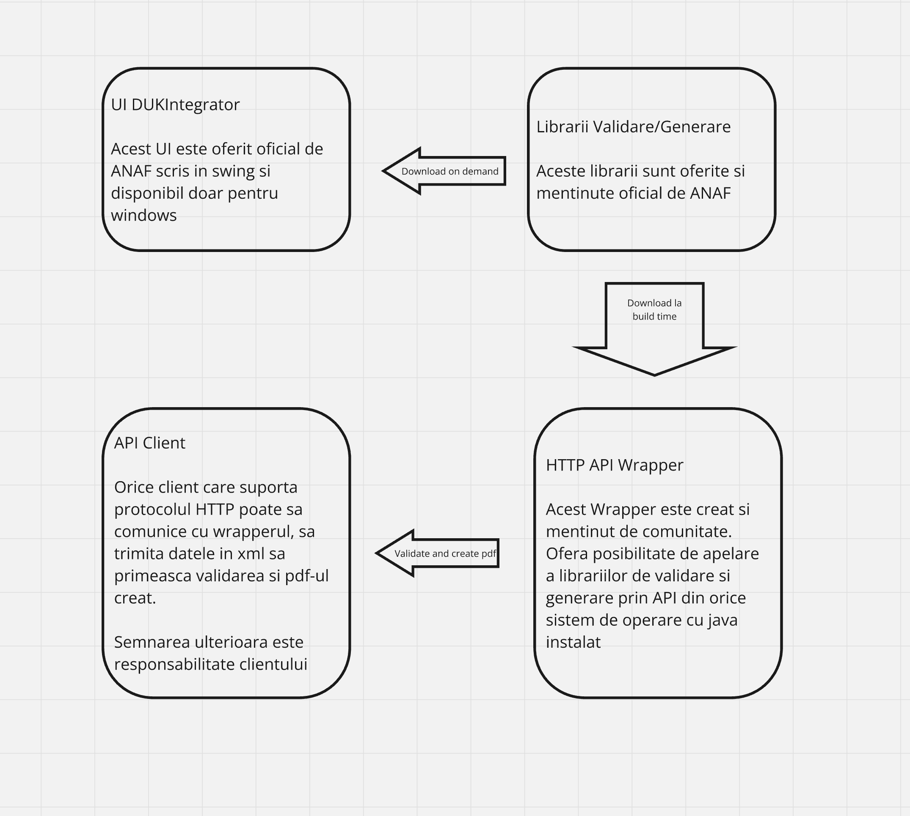

# Descriere

Acest proiect este o variantă **NEOFICIALA** a softului J de depus declarații de pe [site-ul ANAF](https://www.anaf.ro/anaf/internet/ANAF/servicii_online/declaratii_electronice/descarcare_declaratii). 
Librariile sunt descarcate de pe site-ul ANAF. Proiectul utilizează **gradle** ca mecanism de build. 
Proiectul este menținut de [Incremental Community](http://incrementalcommunity.ro).

# Arhitectura




# De ce e nevoie de acest soft ?

Pentru creearea programatica a declaratiilor dupa ce xml-ul a fost generat. DUKIntegrator este disponibil doar in mod GUI si doar pentru windows.

# Sursele

* DUKIntegrator - [Site-ul ANAF](https://www.anaf.ro/anaf/internet/ANAF/servicii_online/declaratii_electronice/descarcare_declaratii)
* Lista librăriilor de validare/creeare pdf pentru fiecare declaratie sunt disponibile [aici](https://static.anaf.ro/static/10/Anaf/update5/versiuni.xml)
* Wrapper pentru validatoare creat de comunitate

# Build

Proiectul foloseste gradle ca mecanism de build și este structurat în două module:
- `api` - Serviciul REST pentru validare și generare PDF
- `gui` (în directorul DUKIntegrator) - Interfața grafică pentru validare și semnare

## Opțiuni de build

Din directorul rădăcină, puteți rula:
```bash
# Build toate modulele
./gradlew build

# Build doar modulul API
./gradlew :api:build

# Build doar modulul GUI
./gradlew :gui:build

# Instalare pentru rulare
./gradlew installDist
```

## Rulare API din linia de comandă

Pentru a rula API-ul fără Docker:
```bash
# Creează distribuția
./gradlew :api:installDist

# Rulează aplicația
cd api/build/install/api/bin
./api    # pe Unix/Mac
api.bat  # pe Windows
```

## Rulare GUI din linia de comandă

Pentru a rula interfața grafică:
```bash
# Creează distribuția
./gradlew :gui:installDist

# Rulează aplicația
cd DUKIntegrator/build/install/gui/bin
./gui    # pe Unix/Mac
gui.bat  # pe Windows
```

## Update al librariilor de pe site-ul ANAF

```bash
./gradlew -q updateFromANAF
git add ./lib config/versiuniCurente.txt
git commit -m "Update librarii validare"
```

Librariile descărcate în directorul `lib` sunt disponibile automat pentru ambele module.

# Start with docker
 
 ```
 docker-compose up -d
 ```
 
 Click: http://localhost:8080

## Requirements

 * Java 17
 * git

# Licența

Deoarece iText-5.0.4 este folosit la DUKIntegrator și la librăriile de validare, licența codului trebuie să fie AGPL. O copie a licenței în engleză se află în fișierul LICENSE.

# Cum pot să ajut ?

[Registrul problemelor este aici](https://github.com/IncrementalDevelopment/declaratii-anaf/issues)

* Poți să faci o propunere de îmbunătățire 
* Poți să rezolvi o problemă și să faci un pull request

# Exemplu validare/generare utilizand API

```
# build

./gradlew installDist

# Start server
docker compose up -d

# JSON
curl -X POST -H "Content-Type: application/json" -d @examples/D106.json http://localhost:5001/validate

# XML
curl -X POST -H "Content-Type: multipart/form-data" -F "file=@examples/D106.xml" -F "decName=d106" http://localhost:5001/upload

# Response
# {"resultCode":0,"message":"Validare fara erori \n","decName":"d106","fileId":"f1a355c1"}

# Download PDF
curl http://localhost:5001/download/f1a355c1

```

# Exemplu validare/generare din java

```
    private Result validateXmlDecl(String declName) throws IOException {

        File xmlFile = new File("examples", declName + ".xml");

        return Result.generateFromXMLString(fileToString(xmlFile), declName);
    }
```

# Lista declaratiilor care pot fi validate/generate

```
A4200
A4201
A4202
A4203
B900
C168
C310
C801
C802
D017
D085
D092
D100
D101G
D101
D104
D106
D107
D108
D10
D110
D112
D114
D119
D120
D130
D163
D169
D169n
D177
D179
D180
D200
D201
D204
D205
D207
D208
D212
D216
D220
D221
D223
D230
D300
D301
D307
D311
D318
D390
D392
D393
D394
D395
D398
D399
D401
D402
D403
D406
D5
D600
D603
D6
D700
D710
D7
D8
D9
DAC6
F3000
F4101
F4102
F4103
F4105
F4109
F7000
L153
N012
N014
P1000
P2000
P4000
P5000
R404
R405
S1001
S1002
S1003
S1004
S1005
S1006
S1007
S1008
S1009
S1010
S1011
S1012
S1013
S1014
S1015
S1016
S1017
S1018
S1019
S1020
S1021
S1022
S1023
S1024
S1025
S1026
S1027
S1028
S1029
S1030
S1031
S1032
S1033
S1034
S1035
S1036
S1037
S1038
S1039
S1040
S1041
S1042
S1043
S1044
S1045
S1046
S1047
S1048
S1049
S1050
S1051
S1052
S1053
S1054
S1055
S1056
S1057
S1058
S1059
S1060
S1061
S1070
S1072
S1073
S1074
S1075
S1076
S1077
S1078
S1100
S1110
S1120
S1121
S1122
S1123
S1124
S1125
S1126
S1127
S1128
T100
T101
```